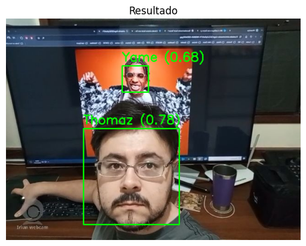

# 🔍 Reconhecimento Facial com TensorFlow e OpenCV

Este projeto foi desenvolvido como parte do **desafio proposto no módulo da DIO (Digital Innovation One)**, com o objetivo de criar um sistema de **reconhecimento facial do zero** utilizando os frameworks e bibliotecas estudados em aula.

---

## 🎯 Desafio da DIO

**Projeto proposto:** Criando um sistema de reconhecimento facial do zero

> O objetivo principal deste projeto é trabalhar com as bibliotecas e frameworks estudados e analisados em nossas aulas. Neste sentido, a proposta padrão envolve um sistema de detecção e reconhecimento de faces, utilizando o framework TensorFlow em conjunto com as bibliotecas que o projetista julgue necessárias, de forma ilimitada.

> O resultado esperado para o modelo proposto é que ele seja capaz de detectar e reconhecer **mais de uma face ao mesmo tempo**.

**Requisitos atendidos:**  
✔️ Utilizar uma rede de detecção treinada para detectar faces (MTCNN)  
✔️ Utilizar uma rede de classificação para classificar a face detectada (CNN personalizada com TensorFlow)

---

## 📸 Objetivo do Projeto

Criar um sistema capaz de:
- Capturar rostos automaticamente via webcam (Google Colab);
- Detectar rostos em imagens usando uma rede pré-treinada (MTCNN);
- Treinar um modelo CNN personalizado com TensorFlow;
- Reconhecer rostos detectados com base nos dados treinados;
- Avaliar visualmente a acurácia e performance do modelo.

---

## 🧪 Tecnologias Utilizadas

- Python 3.x
- TensorFlow / Keras
- OpenCV
- MTCNN (face detection)
- Google Colab

---

## 🚀 Etapas do Projeto

1. **Coleta de dados via webcam**  
   Utilizando o Javascript no Google Colab para capturar imagens automaticamente com MTCNN.

2. **Pré-processamento e organização**  
   Imagens organizadas por pastas com nome do indivíduo.

3. **Treinamento do modelo**  
   Rede neural convolucional (CNN) com ImageDataGenerator e validação cruzada.

4. **Avaliação visual da performance**  
   Plot da acurácia ao longo das épocas de treino.

5. **Reconhecimento facial em tempo real**  
   Captura de nova imagem e inferência do modelo para prever a identidade.

---

## 🧠 Resultados

- Treinamento bem-sucedido com alta acurácia para classes específicas (faces conhecidas).
- Reconhecimento funcional em tempo real via webcam.
- Utilização prática de MTCNN e TensorFlow em pipeline completo.
- Capacidade de detectar e classificar múltiplas faces na imagem.

---

## 📷 Exemplo de Execução

*Exemplo de execução pode ser verificado abaixo*

---

## ⚠️ Observações

- O código foi desenvolvido para rodar no Google Colab com suporte à webcam via navegador.
- O projeto não utiliza um dataset externo; todas as imagens foram coletadas diretamente com a câmera.
- Pode ser adaptado facilmente para rodar com outros datasets ou em ambientes locais.

---

## 📌 Como Rodar

O notebook foi desenvolvido no Google Colab.  
Acesse diretamente aqui:

👉 [`Reconhecimento_Facial.ipynb`](Reconhecimento_Facial.ipynb)

Execute as células sequencialmente;

Capture os rostos e teste o reconhecimento.

---

## 📄 Licença

Este projeto é de uso acadêmico e pessoal. Imagens de terceiros (como o cantor Yame) foram utilizadas apenas para fins de estudo.
